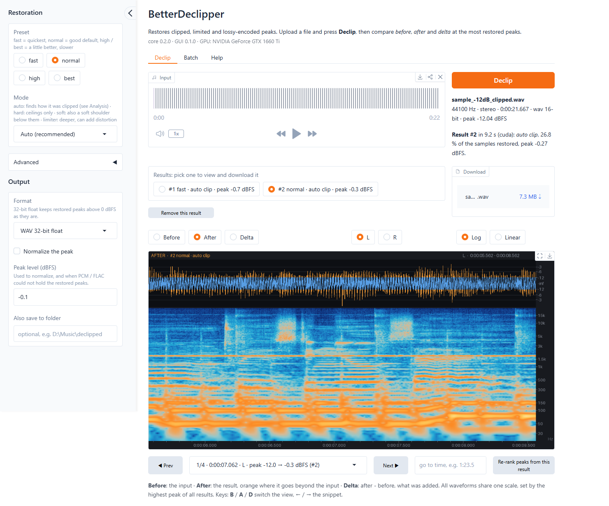
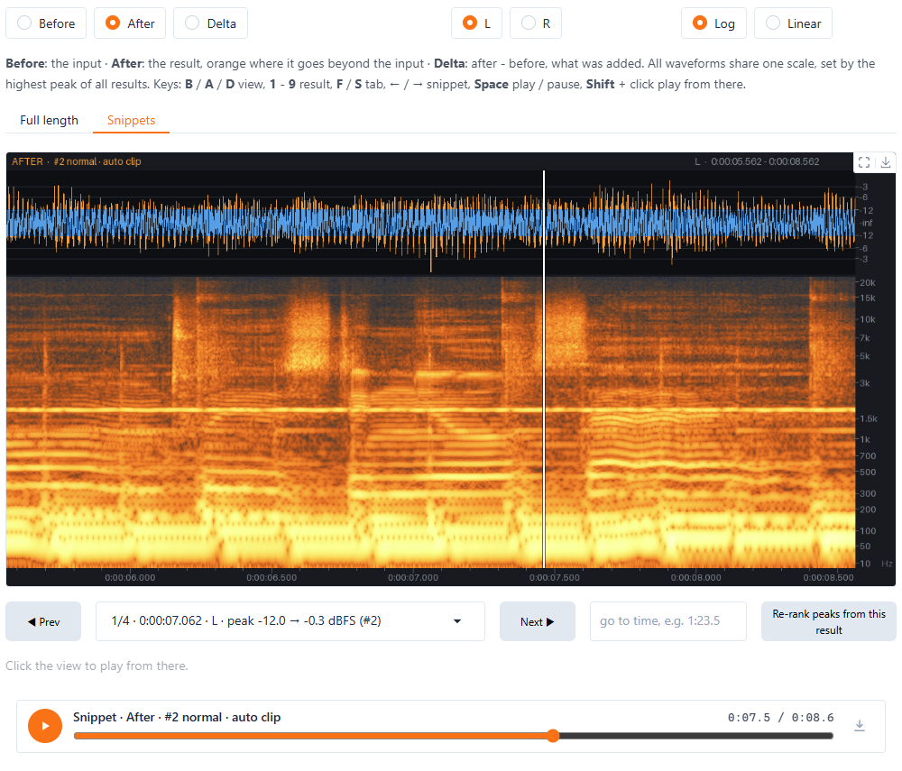
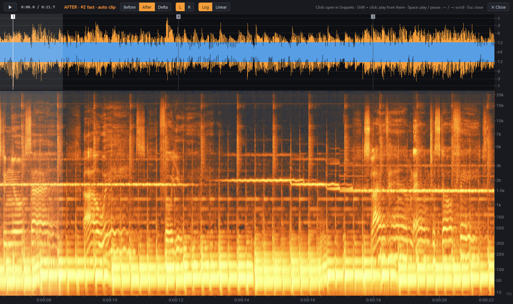

# BetterDeclipper GUI

A simple web interface for [BetterDeclipper](https://github.com/Qupci/BetterDeclipper), the offline
declipper that restores clipped, limited and lossy-encoded peaks. Drop in a file, press **Declip**, and
look at the result the way iZotope RX shows audio: a waveform with a dB scale over a spectrogram in RX's
colors and resolution, for the whole file and up close at the peaks the restoration changed the most.

No GPU, or no Python? Run it on Google Colab's free GPU with one click:
[](https://colab.research.google.com/github/Qupci/BetterDeclipperGUI/blob/main/BetterDeclipperGUI.ipynb)







## What it does

- **Declip** a file with the declipper's presets (`fast` ... `best`) and modes (`auto` analysis,
  `hard`, `soft`, `limiter`, `legacy`); the analysis of how the file was clipped is shown in plain text.
  The **Declip** button sits right under the settings, so they are in sight when you press it. It can be
  pressed while the file is still uploading: the file is declipped as soon as it is there, with the
  settings as they are then.
- **Full length**: the whole result, with numbered flags at the most restored peaks. Click a flag, or any
  other moment, to look at it closely in **Snippets**; Shift+click (or Ctrl+click) plays from there instead.
- **Full length horizontal mode** (or **H**): the whole file across the screen at 15 seconds per screen width
  (the snippets show 3), as high as the window, scrolling sideways (scroll bar, mouse wheel, **←** / **→**).
  It works like the full length view, with the same view, channel and scale switches; while it plays, the view
  follows the playhead. **Esc** closes it.
- **Snippets**: 3 s views, each centered on one of the most restored peaks (up to 10, most restored first,
  at least 5 s apart so they show different moments; the channel follows the peak). Step through them, or
  type any time (`1:23.5`). A moment picked before the first result stays on view when it comes in.
- Both views have a waveform with a dB amplitude ruler, a spectrogram with a log or linear frequency axis,
  and an h:m:s timeline. Switch between **Before** (the input), **After** (the result; what the
  restoration added is drawn in orange) and **Delta** (after - before), and between channels. With a forced
  clip level (Advanced), every sample at or above it counts as clipped, so that result's **Before** is the
  input clipped at the level. That is only for viewing and listening: the declipper always gets the input as
  it is.
- **Compare settings**: every run is kept in a list of results. The view stays where it is, so a run with
  another preset or mode is compared at the same place. The declipper's analysis of the file is made once
  and reused, so another preset or mode only repeats the restoration (about 7 s less per run on a 75 s
  track). All waveforms share one scale, set by the highest peak of all results (restored peaks often
  exceed 0 dBFS, a red line marks it); remove a result and the scale follows the remaining ones.
- **Listen** to the whole result or to the snippet on view: **Space** plays and pauses, a playhead runs
  over the view, and a click plays from a moment. Playback carries on when you switch between before,
  after and delta or between results (the new version takes over at the same moment, with a short
  cross-fade), so you hear the difference right away. All versions play at one common gain (turned down
  only when the highest peak of all results exceeds 0 dBFS), so their levels compare fairly and nothing
  clips.
- **Download** as 32-bit float WAV (keeps peaks above 0 dBFS), 24/16-bit WAV or 24/16-bit FLAC; the
  download sits in the sidebar under the output settings (and next to the result list). PCM and FLAC cannot
  store peaks above 0 dBFS, so by default (**Level**: *Turn down to the peak level*) they are turned down to
  the chosen peak level instead of clipping them again, never turned up (32-bit float stays as restored). Or **Level** applies a
  fixed gain of 0, -3.01, -6.02, -9.03 or -12.04 dB (n x 10 log10 2) and PCM / FLAC clip what still exceeds
  0 dBFS.
- **Batch**: declip many files, or every audio file in a folder, with the same settings; download them as
  a zip, or have them saved to an output folder (set on the Batch tab or as *Also save to folder* in the
  sidebar: they are the same). Results are named like the command line names them,
  `song [auto clip normal].wav`.

Keys:

| Key | |
|---|---|
| **B** / **A** / **D** | before / after / delta |
| **1** ... **9** | the first nine results (remove results you no longer need to reach later ones) |
| **F** / **S** | full length / snippets |
| **←** / **→** | previous / next snippet (horizontal mode: scroll) |
| **H** | full length horizontal mode (**Esc** closes it) |
| **Space** | play / pause the view on screen |
| **Shift** + click | play from there (also Ctrl + click; in Snippets a plain click does it) |

## Installation

An NVIDIA GPU makes declipping about 20x faster than the CPU (see the declipper's README for timings),
but the CPU works too.

### Windows, the easy way

1. Install [Python](https://www.python.org/downloads/) 3.10 or newer and tick *Add python.exe to PATH*.
2. Download this repository (**Code > Download ZIP**) and unzip it.
3. Double-click **`install.bat`**. It sets everything up in a `.venv` folder next to it: the CUDA build of
   torch if an NVIDIA GPU is present (about 2.5 GB), else the CPU build, then the declipper and the GUI.
4. Double-click **`run.bat`**: the app opens in your browser. Close the console window to stop it.

To update the declipper to its latest version later, run `install.bat` again.

### With pip (any system)

```
pip install torch --index-url https://download.pytorch.org/whl/cu126   # NVIDIA GPU (skip for CPU only)
pip install https://github.com/Qupci/BetterDeclipperGUI/archive/refs/heads/main.zip
betterdeclipper-gui
```

Install the CUDA build of torch first, since pip otherwise pulls the CPU build as a dependency. `cu126`
supports NVIDIA GPUs from the GTX 900 series on; RTX 50-series GPUs need a newer build (`cu128`, see
[pytorch.org](https://pytorch.org/get-started/locally/)). The GUI installs the declipper
(`betterdeclipper`) from its GitHub repository, so both the `betterdeclipper` command line tool and
`betterdeclipper-gui` are available afterwards. pip keeps an installed declipper as it is; to update it:

```
pip install --force-reinstall --no-deps https://github.com/Qupci/BetterDeclipper/archive/refs/heads/main.zip
```

The GUI reuses the declipper's analysis between runs from betterdeclipper 0.3.0 on (it shows its version
under the title); with an older one every run analyzes the file again.

From a clone: `pip install -e .`, then `betterdeclipper-gui` or `python -m betterdeclipper_gui`.

### Google Colab

[](https://colab.research.google.com/github/Qupci/BetterDeclipperGUI/blob/main/BetterDeclipperGUI.ipynb)

Open [`BetterDeclipperGUI.ipynb`](BetterDeclipperGUI.ipynb) in Colab (it asks for the free T4 GPU), run
**Start BetterDeclipper** and open the `gradio.live` link it prints. To work with files in your Google Drive,
run **Connect Google Drive** first: then the Batch tab's folder field and *Also save to folder* take Drive
folders such as `/content/drive/MyDrive/Music`, so a whole folder can be declipped and saved back to Drive.
Anyone with the link can use the app while it runs, so keep it to yourself.

By hand, in any notebook with a GPU runtime (Colab already has the CUDA build of torch):

```
!pip install https://github.com/Qupci/BetterDeclipperGUI/archive/refs/heads/main.zip
!betterdeclipper-gui --share
```

## Options

```
betterdeclipper-gui [--host HOST] [--port PORT] [--share] [--no-browser] [--allow-folders]
```

- `--port`: the port (default 7860, or the next free one).
- `--host 0.0.0.0`: reachable from other devices on the local network (default: this computer only).
- `--share`: also create a temporary public link (Colab, or to use it from another place).
- `--no-browser`: don't open a browser tab.
- `--allow-folders`: *Also save to folder* and batch folders read and write files on the computer running
  the app, so they are hidden when others can reach it (`--share`, `--host`); this keeps them.

Files are processed on the computer running the app and stay there. Uploads and results live in a
temporary folder that is removed about an hour after the browser tab was closed, and when the app stops
(at its next start, if its console window was simply closed).

## The view

The spectrogram was matched to iZotope RX: RX screenshots of a song were turned back into dB through RX's
own color bar and compared pixel by pixel with renderings of the same audio.

- **Colors**: RX's default gradient, black at -120 dB through navy, brown and orange to white at 0 dB
  (0 dB is a full-scale sine, as in RX).
- **Log axis**: RX's, linear in ln(1 + f / 100 Hz) from 0 Hz to Nyquist (not a plain logarithm, which would
  stretch the lowest octaves).
- **Snippets, linear axis**: like RX's automatic STFT at that zoom, one Hann window of about 5.5 pixel
  columns (13.6 ms for 3 s), 16x time overlap and 8x zero padding (correlation with RX 0.995, 2.4 dB rms).
- **Snippets, log axis**: RX's multi-resolution mode at FFT size 512: 512, 1024 and 2048-sample windows
  (at 44.1 kHz) above 1/8 of Nyquist, between 1/32 and 1/8, and below, cross-faded at the edges
  (correlation 0.993).
- **Full length**: one 2048 (linear) or 4096-sample (log) window at 44.1 kHz, its power averaged over each
  column.

Bins and frames are reduced onto rows and columns by their maximum, so thin harmonics and clicks stay
visible. Clipping shows up as a haze of distortion between the harmonics and as vertical smears at the
peaks; a good restoration clears them, and the delta view shows what was added.

## License

BetterDeclipper GUI is licensed under the MIT License (see [LICENSE](LICENSE)), like
[BetterDeclipper](https://github.com/Qupci/BetterDeclipper), which it builds on.
